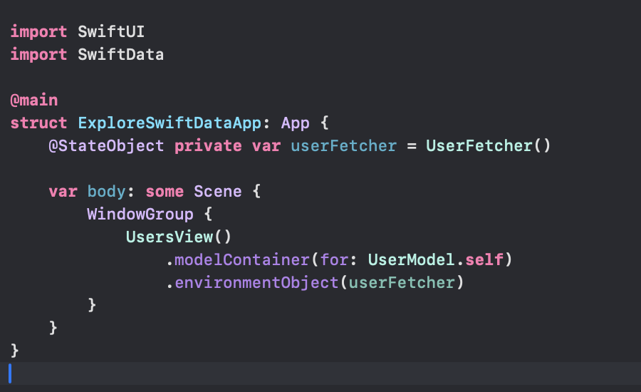

# Exploring SwiftData 
I'm still exploring SwiftData and I made an example. I fetch the data from fake api service(jsonplaceholder) and show it on the list. My models are Decodable and SwiftData Model(@Model). There is no problem when I fetch the data but if I try to access a nested model's variable SwiftData crashes. I think if I want to access a nested model, I must save the data first. That's why we must create different models for API service and SwiftData. This is my opinion.

It crashes

It doesn't crash

UserModel

UserFetcher

Main

